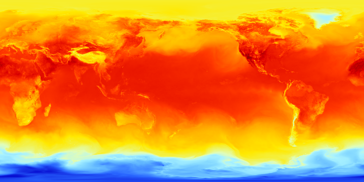
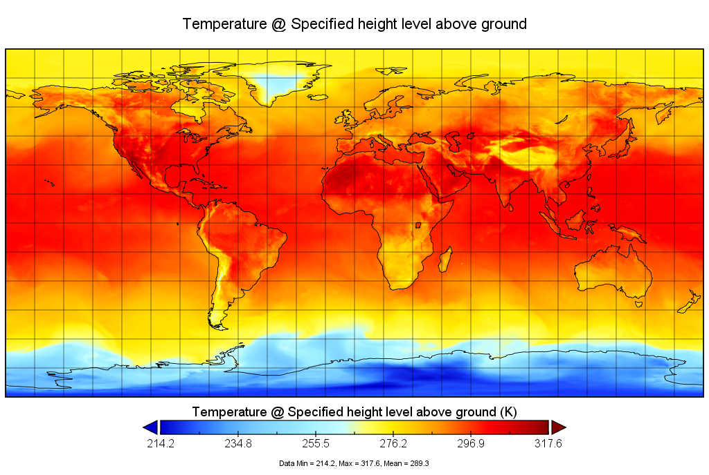

### grib2-plot 🗃

读取 grib2 文件，生成渐变 plot 图，仅供参考。

**Note:**  图片经纬度起始范围(从左至右，从上至下)，lon: [0 ~ 360]，lat: [90 ~ -90]

#### [panoply](https://www.giss.nasa.gov/tools/panoply/) 生成图

### 依赖库

- [netcdfAll-5.2.0](https://github.com/Unidata/netcdf-java) (用来读取 grib2、nc、hdf 等气象数据的科学库)
- [fastJson-1.2.72](https://github.com/alibaba/fastjson) (用来处理json格式的数据)

### 数据

Weather data is produced by the Global Forecast System (GFS), operated by the US National Weather Service. Forecasts are produced four times daily and made available for download from [NOMADS](http://nomads.ncep.noaa.gov/). 

